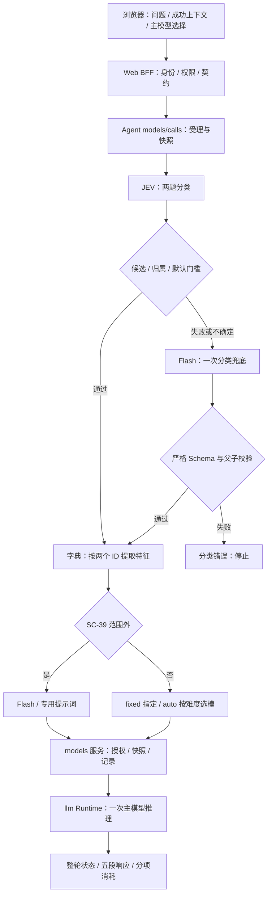
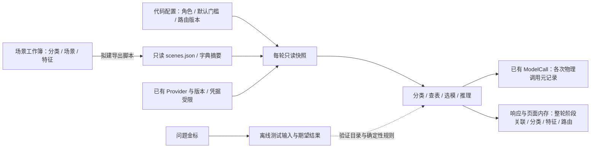
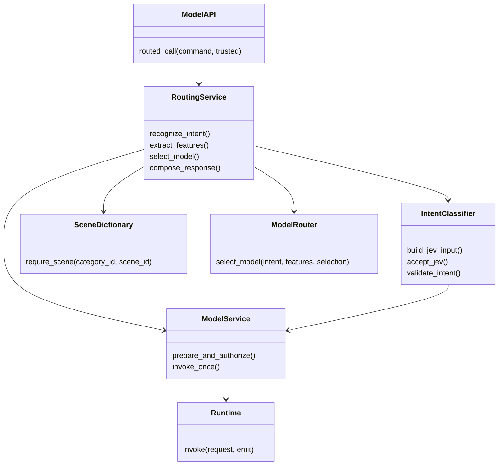
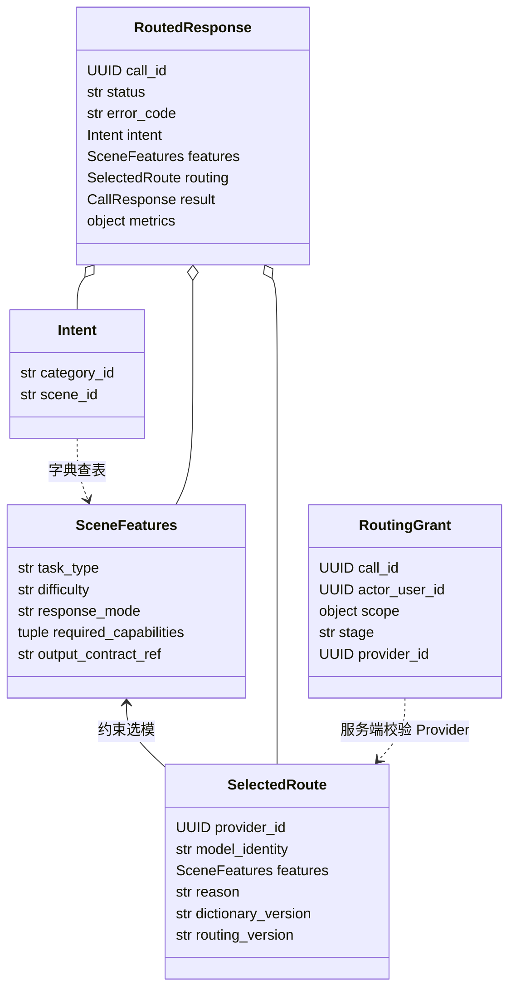
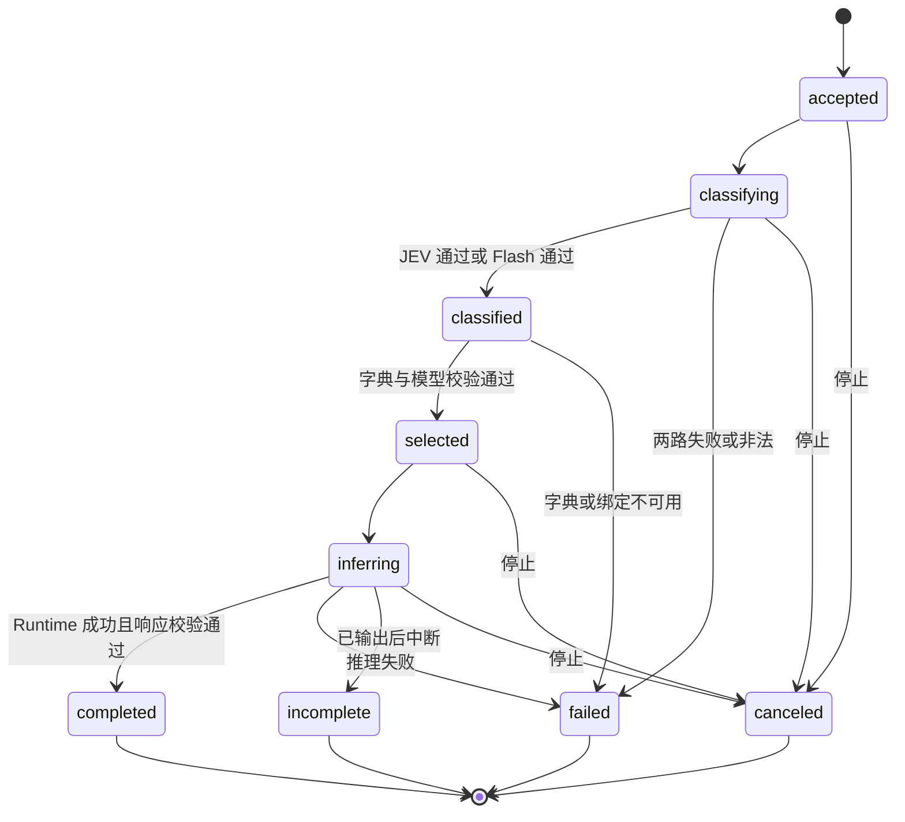
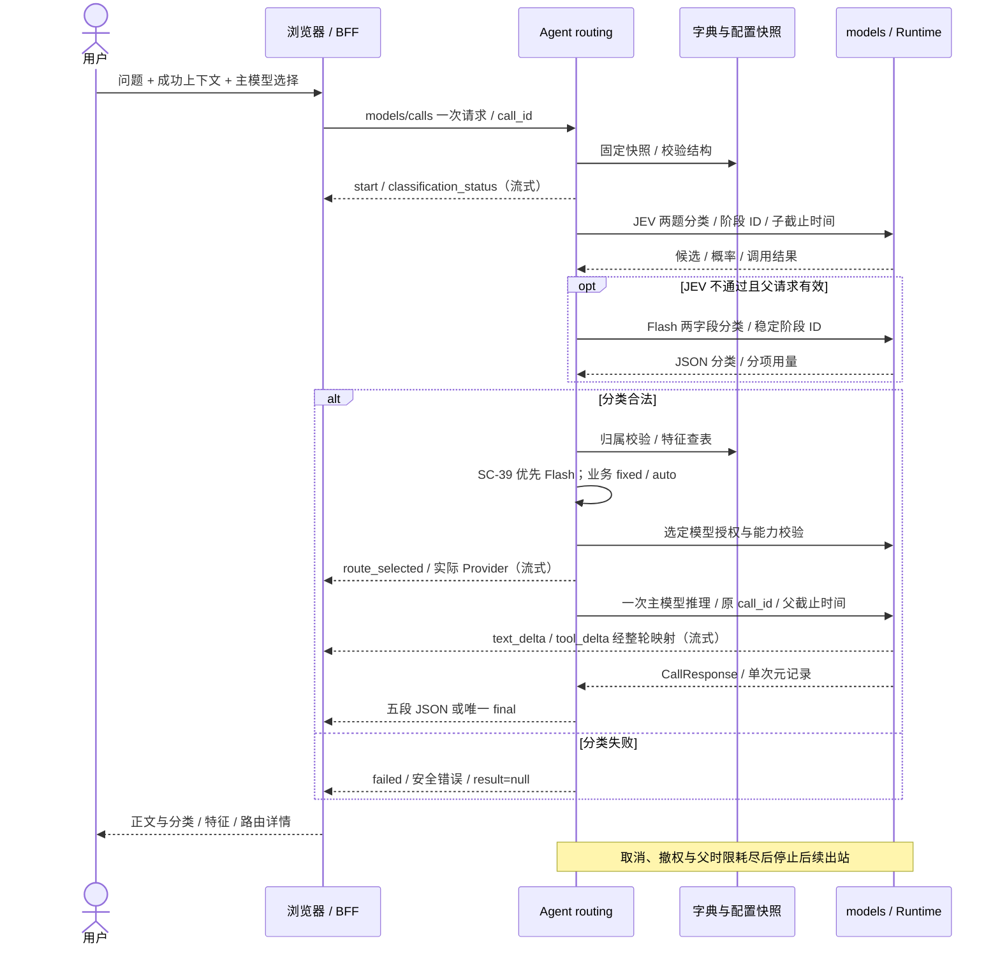

<!-- diagram:architecture -->

```mermaid
flowchart TD
    U[浏览器：问题 / 成功上下文 / 主模型选择] --> B[Web BFF：身份 / 权限 / 契约]
    B --> A[Agent models/calls：受理与快照]
    A --> J[JEV：两题分类]
    J --> V{候选 / 归属 / 默认门槛}
    V -->|通过| D[字典：按两个 ID 提取特征]
    V -->|失败或不确定| F[Flash：一次分类兜底]
    F --> W{严格 Schema 与父子校验}
    W -->|通过| D
    W -->|失败| X[分类错误：停止]
    D --> S{SC-39 范围外}
    S -->|是| O[Flash / 专用提示词]
    S -->|否| R[fixed 指定 / auto 按难度选模]
    O --> M[models 服务：授权 / 快照 / 记录]
    R --> M
    M --> L[llm Runtime：一次主模型推理]
    L --> Z[整轮状态 / 五段响应 / 分项消耗]
```

<!-- diagram:data -->

```mermaid
flowchart LR
    W[场景工作簿：分类 / 场景 / 特征] -->|拟建导出脚本| D[只读 scenes.json / 字典摘要]
    G[问题金标] --> T[离线测试输入与期望结果]
    C[代码配置：角色 / 默认门槛 / 路由版本] --> S[每轮只读快照]
    D --> S
    P[已有 Provider 与版本 / 凭据受限] --> S
    S --> I[分类 / 查表 / 选模 / 推理]
    I --> R[已有 ModelCall：各次物理调用元记录]
    I --> O[响应与页面内存：整轮阶段关联 / 分类 / 特征 / 路由]
    T -.->|验证目录与确定性规则| I
```

<!-- diagram:components -->

```mermaid
classDiagram
    class ModelAPI {
        routed_call(command, trusted)
    }
    class RoutingService {
        recognize_intent()
        extract_features()
        select_model()
        compose_response()
    }
    class IntentClassifier {
        build_jev_input()
        accept_jev()
        validate_intent()
    }
    class SceneDictionary {
        require_scene(category_id, scene_id)
    }
    class ModelRouter {
        select_model(intent, features, selection)
    }
    class ModelService {
        prepare_and_authorize()
        invoke_once()
    }
    class Runtime {
        invoke(request, emit)
    }
    ModelAPI --> RoutingService
    RoutingService --> IntentClassifier
    RoutingService --> SceneDictionary
    RoutingService --> ModelRouter
    RoutingService --> ModelService
    IntentClassifier --> ModelService
    ModelService --> Runtime
```

<!-- diagram:contracts -->

```mermaid
classDiagram
    class Intent {
        str category_id
        str scene_id
    }
    class SceneFeatures {
        str task_type
        str difficulty
        str response_mode
        tuple required_capabilities
        str output_contract_ref
    }
    class SelectedRoute {
        UUID provider_id
        str model_identity
        SceneFeatures features
        str reason
        str dictionary_version
        str routing_version
    }
    class RoutingGrant {
        UUID call_id
        UUID actor_user_id
        object scope
        str stage
        UUID provider_id
    }
    class RoutedResponse {
        UUID call_id
        str status
        str error_code
        Intent intent
        SceneFeatures features
        SelectedRoute routing
        CallResponse result
        object metrics
    }
    Intent ..> SceneFeatures : 字典查表
    SceneFeatures <-- SelectedRoute : 约束选模
    RoutedResponse o-- Intent
    RoutedResponse o-- SceneFeatures
    RoutedResponse o-- SelectedRoute
    RoutingGrant ..> SelectedRoute : 服务端校验 Provider
```

<!-- diagram:states -->

```mermaid
stateDiagram-v2
    [*] --> accepted
    accepted --> classifying
    classifying --> classified: JEV 通过或 Flash 通过
    classifying --> failed: 两路失败或非法
    classified --> selected: 字典与模型校验通过
    classified --> failed: 字典或绑定不可用
    selected --> inferring
    inferring --> completed: Runtime 成功且响应校验通过
    inferring --> failed: 推理失败
    inferring --> incomplete: 已输出后中断
    accepted --> canceled: 停止
    classifying --> canceled: 停止
    selected --> canceled: 停止
    inferring --> canceled: 停止
    completed --> [*]
    failed --> [*]
    incomplete --> [*]
    canceled --> [*]
```

<!-- diagram:sequence -->

```mermaid
sequenceDiagram
    actor U as 用户
    participant B as 浏览器 / BFF
    participant A as Agent routing
    participant D as 字典与配置快照
    participant M as models / Runtime
    U->>B: 问题 + 成功上下文 + 主模型选择
    B->>A: models/calls 一次请求 / call_id
    A->>D: 固定快照 / 校验结构
    A-->>B: start / classification_status（流式）
    A->>M: JEV 两题分类 / 阶段 ID / 子截止时间
    M-->>A: 候选 / 概率 / 调用结果
    opt JEV 不通过且父请求有效
        A->>M: Flash 两字段分类 / 稳定阶段 ID
        M-->>A: JSON 分类 / 分项用量
    end
    alt 分类合法
        A->>D: 归属校验 / 特征查表
        A->>A: SC-39 优先 Flash；业务 fixed / auto
        A->>M: 选定模型授权与能力校验
        A-->>B: route_selected / 实际 Provider（流式）
        A->>M: 一次主模型推理 / 原 call_id / 父截止时间
        M-->>B: text_delta / tool_delta 经整轮映射（流式）
        M-->>A: CallResponse / 单次元记录
        A-->>B: 五段 JSON 或唯一 final
    else 分类失败
        A-->>B: failed / 安全错误 / result=null
    end
    B-->>U: 正文与分类 / 特征 / 路由详情
    Note over A,M: 取消、撤权与父时限耗尽后停止后续出站
```
